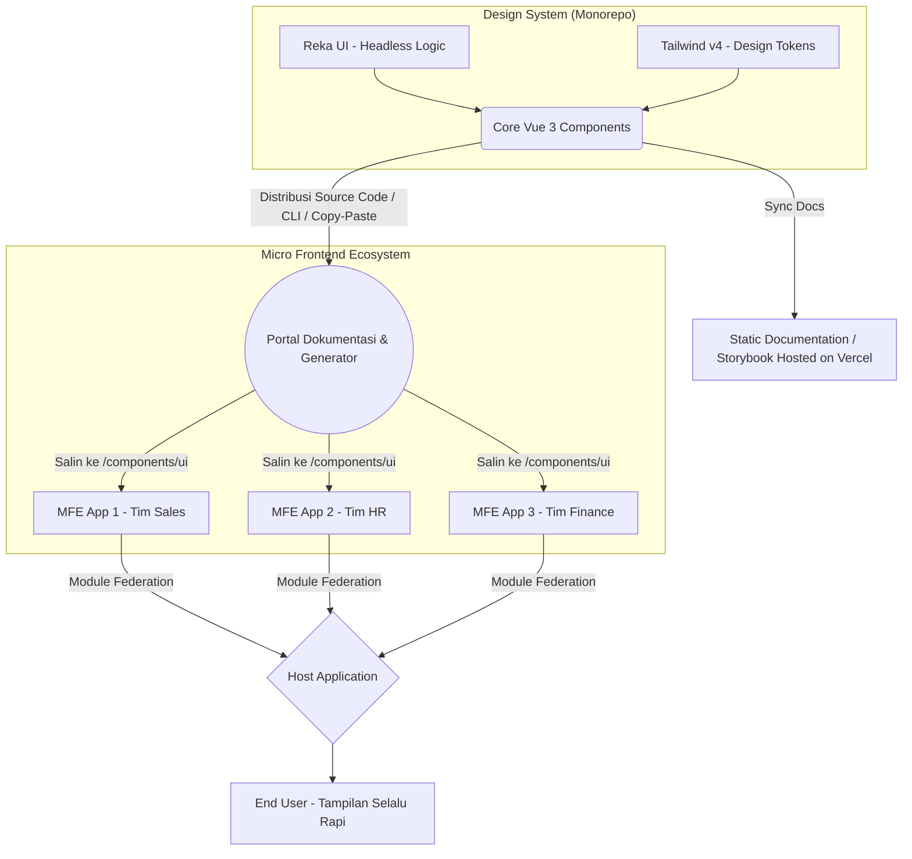

# PRD — Project Requirements Document

## 1. Overview
Aplikasi ini adalah sebuah **Sistem Desain (Design System Library)** berpusat pada Vue 3 yang diciptakan untuk memecahkan masalah inkonsistensi antarmuka (UI) pada pengembangan aplikasi skala besar. Sebelumnya, penggunaan komponen yang terisolasi (seperti konsep dasar shadcn) seringkali memicu gaya UI yang melenceng seiring bertumbuhnya aplikasi.

Tujuan utama proyek ini adalah menyediakan "sumber kebenaran tunggal" (Single Source of Truth) untuk komponen dan *styling* yang bersifat *end-to-end*. Dengan menggabungkan Vue 3, Reka UI, dan Tailwind CSS v4, sistem desain ini dirancang agar siap pakai untuk arsitektur *Micro Frontend* (MFE), sehingga berbagai tim dapat bekerja lebih cepat, komponen mudah disesuaikan, dan tampilan aplikasi akhir akan selalu rapi serta seragam. Proyek ini bersifat murni sebagai *frontend library* tanpa ketergantungan pada arsitektur backend, API, atau database eksternal.

Model distribusi komponen mengadopsi pola **"Copy & Paste" atau "CLI-based installation"** yang terinspirasi langsung dari **shadcn/ui**. Alih-alih dikemas sebagai library NPM yang terkunci (*black-box*), setiap komponen didistribusikan sebagai **distributable source code** yang dapat disalin langsung ke dalam direktori lokal proyek (misalnya `/components/ui`). Hal ini memberikan developer kendali penuh atas kode, styling, dan logika komponen setelah diinstal, sekaligus memastikan bahwa setiap elemen tetap terhubung secara kuat dengan inti logika aksesibilitas (Reka UI) dan sistem tema global (Tailwind v4) yang dikelola secara terpusat.

## 2. Requirements
- **Terpusat & Terstandarisasi:** Harus menyediakan library komponen terpusat yang bisa didistribusikan ke berbagai tim.
- **Dukungan Micro Frontend (MFE):** Arsitektur library harus kompatibel untuk diintegrasikan ke dalam berbagai aplikasi mandiri (Micro Frontend) tanpa konflik *styling*.
- **Konsumsi Komponen ala Shadcn UI:** Penggunaan komponen mengikuti paradigma 'copy-paste' atau instalasi via CLI ke dalam codebase lokal (misalnya `/src/components/ui`), bukan sebagai dependensi biner NPM yang terenkapsulasi.
- **Kontrol Penuh atas Source Code:** Komponen bersifat 'distributable source code' yang memungkinkan developer memiliki hak akses dan kemampuan modifikasi penuh terhadap logika serta styling setelah diinstal. Developer dapat menyesuaikan komponen secara mendalam tanpa terikat oleh siklus versi library eksternal.
- **Koneksi ke Core Logic & Tema Global:** Meski didistribusikan sebagai *source code* lokal, setiap komponen tetap secara internal bergantung pada Reka UI (untuk aksesibilitas dan logika headless) serta Tailwind CSS v4 (untuk *design tokens* dan tema global), memastikan konsistensi tetap terjaga.
- **Styling Dinamis:** Harus mendukung kustomisasi tema secara menyeluruh menggunakan Tailwind CSS v4 (mudah diubah warnanya).
- **Performa & Ukuran:** Harus ringan dan mendukung *tree-shaking* agar tidak membebani aplikasi utama.
- **Desain Responsif Bawaan:** Seluruh komponen harus mendukung desain responsif (Responsive Design) secara bawaan, memastikan tampilan optimal dan adaptif di berbagai ukuran layar (Mobile, Tablet, Desktop) tanpa memerlukan penyesuaian manual tambahan.

## 3. Core Features
- **Library Komponen Dasar (First Win):** Kumpulan elemen UI esensial (Tombol, Form, Modal, Navigasi) yang siap pakai dan terstandarisasi.
- **Distribusi & Integrasi ala Source-Code (CLI/Manual Mirip shadcn):** Skenario instalasi yang memungkinkan developer memasukkan komponen langsung ke folder lokal melalui antarmuka CLI (command-line interface) atau manual copy-paste dari portal dokumentasi. Ini memberikan transparansi kode penuh, kemudahan debugging, dan kemampuan modifikasi tanpa batas.
- **Sistem Tema Global (Global Theming):** Pengaturan *design token* terpusat yang memungkinkan developer mengubah palet warna, tipografi, dan spasi aplikasi dengan satu konfigurasi.
- **MFE Integration Ready:** Dokumentasi dan struktur ekspor komponen yang dikhususkan agar mudah disematkan (embed) pada berbagai *platform* atau *sub-aplikasi* yang berbeda.
- **Dokumentasi Interaktif (Storybook/VitePress):** Halaman dokumentasi statis bagi developer dan desainer untuk melihat, mencoba, dan menyalin cara penggunaan komponen.
- **Aksesibilitas Bawaan (A11y):** Dukungan navigasi keyboard dan *screen reader* secara otomatis berkat penggunaan Reka UI sebagai mesin dasar komponen.
- **Responsivitas Otomatis pada Semua Komponen:** Setiap elemen UI dilengkapi dengan sistem *breakpoint* bawaan yang menangani peralihan tata letak secara halus, menjamin pengalaman pengguna yang konsisten dan optimal di seluruh rentang perangkat (Mobile, Tablet, Desktop).

## 4. User Flow
1. **Instalasi:** Developer dari salah satu tim Micro Frontend menginisialisasi konfigurasi desain sistem pada aplikasinya (menyiapkan Tailwind v4 dan core dependencies seperti Vue 3 & Reka UI).
2. **Pengaturan Tema:** Developer melakukan konfigurasi *Tailwind v4* pada aplikasinya agar sesuai dengan token sistem desain (atau memilih tema yang sudah disediakan).
3. **Ambil & Pasang ke Lokal (Workflow ala shadcn/ui):** Developer membuka portal dokumentasi atau menjalankan CLI, memilih komponen yang dibutuhkan (misal: `Button` atau `Modal`), lalu komponen tersebut secara otomatis disalin sebagai *source code* mentah ke dalam direktori lokal proyek (misalnya `/src/components/ui/`). Jika dilakukan manual, developer menyalin kode Vue 3, TypeScript, dan class Tailwind yang sesuai dari dokumentasi ke folder lokal tersebut.
4. **Pengembangan & Kustomisasi Penuh:** Developer mengimpor komponen dari jalur lokal tersebut ke dalam kode Vue 3 mereka. Karena merupakan *source code* yang sudah menjadi milik proyek, developer memiliki kendali penuh untuk mengubah logika atau styling tanpa khawatir konflik versi library, sembari tetap memanfaatkan core logic Reka UI dan tema Tailwind v4 yang telah dikonfigurasi.
5. **Hasil Akhir:** Aplikasi yang dikembangkan otomatis memiliki tampilan yang rapi dan konsisten dengan aplikasi dari tim lain, sekaligus memberikan kecepatan pengembangan dan fleksibilitas kustomisasi yang maksimal.

## 5. Architecture
Untuk sebuah Sistem Desain yang mendukung Micro Frontend, arsitekturnya berfokus sepenuhnya pada bagaimana pustaka (library) disusun, dikemas, dan didistribusikan ke berbagai *consumer apps*. Tidak ada lapisan backend atau database yang terlibat; seluruh alur distribusi bergantung pada manajemen paket dan inisialisasi di sisi klien. Dokumentasi bersifat statis dan di-hosting secara terpisah. Pendekatan *source-code distribution* memastikan setiap MFE menerima salinan kode komponen yang dapat dimodifikasi secara independen, sementara tetap merujuk pada desain token global.

## 6. Tech Stack
Berikut adalah teknologi yang dikurasi untuk pengembangan sistem desain ini, yang sepenuhnya berjalan di sisi klien dan alat pembangunan *frontend*:

- **Frontend & Library Core:** Vue 3 (Composition API), Reka UI (Headless components), Tailwind CSS v4 (*Styling engine* dengan kemampuan *breakpoint* responsif untuk memastikan tampilan optimal di berbagai ukuran layar Mobile, Tablet, dan Desktop).
- **Distribution & CLI Tooling:** Script generator berbasis Node.js/TypeScript atau integrasi CLI yang memungkinkan pengambilan komponen sebagai file source code mentah ke direktori lokal, meniru pengalaman developer shadcn/ui secara presisi.
- **Tools Pengembangan Library:** Vite (Build tool yang cepat), Monorepo manager (Turborepo atau pnpm workspaces) untuk manajemen kode komponen secara terpusat.
- **Dokumentasi & Preview:** Storybook atau VitePress (Untuk portal dokumentasi statis, visual testing, dan preview interaktif komponen secara lokal, serta antarmuka untuk menyalin kode komponen).
- **Deployment & Publikasi:**
  - *Library:* NPM Registry (Private/Public) atau GitHub Packages (fokus pada publikasi paket distribusi & CLI, bukan paket komponen biner).
  - *Portal Referensi:* Vercel atau Netlify (Static site hosting untuk dokumentasi dan demo).
- **Catatan Arsitektur:** Seluruh sistem dirancang tanpa dependensi kepada server, backend, atau database internal. Semua tema, konfigurasi, dan *design tokens* ditangani sepenuhnya via *build-time compilation* menjadi CSS yang dapat di-*tree-shake* oleh aplikasi *consumer*. Komponen didistribusikan sebagai *source code* yang memungkinkan developer melakukan override styling atau logika secara lokal tanpa melanggar prinsip Single Source of Truth untuk desain sistem secara keseluruhan.